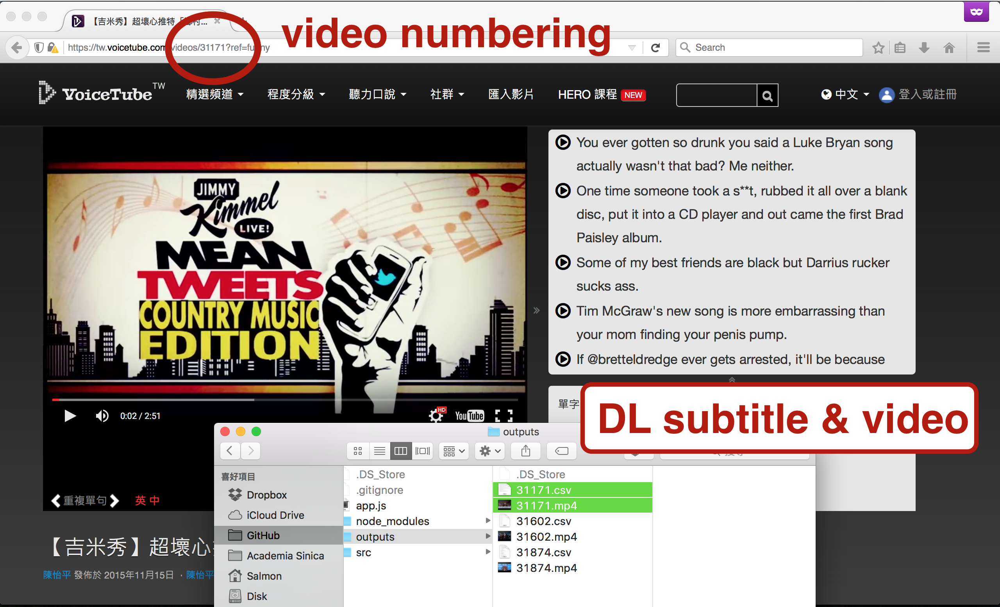
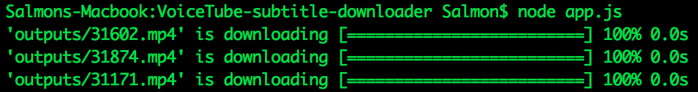

---

* Install [Node.js](https://nodejs.org/). ( above v0.12 )

* Choose videos you wanna download in 'VoiceTube.com'.

```
// Plz open the app.js file, and change the text line 21.
// Key-in the url path that you wanna download.
// If url is 'https://tw.voicetube.com/videos/26956?ref=funny',
// the number of video is '26956'.

var videoNum = [numberA, numberB, ...];
```

* Run the 'app.js'.

```
node ./VoiceTube-subtitle-downloader/app.js
```

* You will download your data in 'outputs' folder.

```
Subtitle.csv (second, text) 
Video.mp4
```